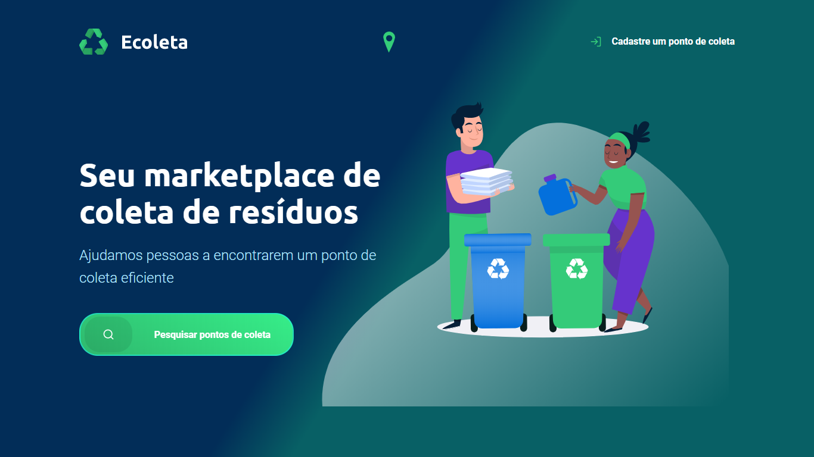
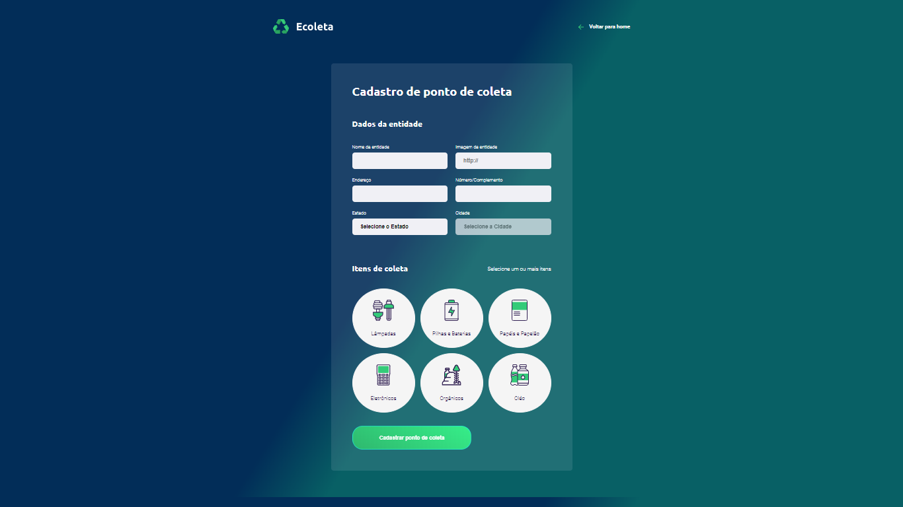
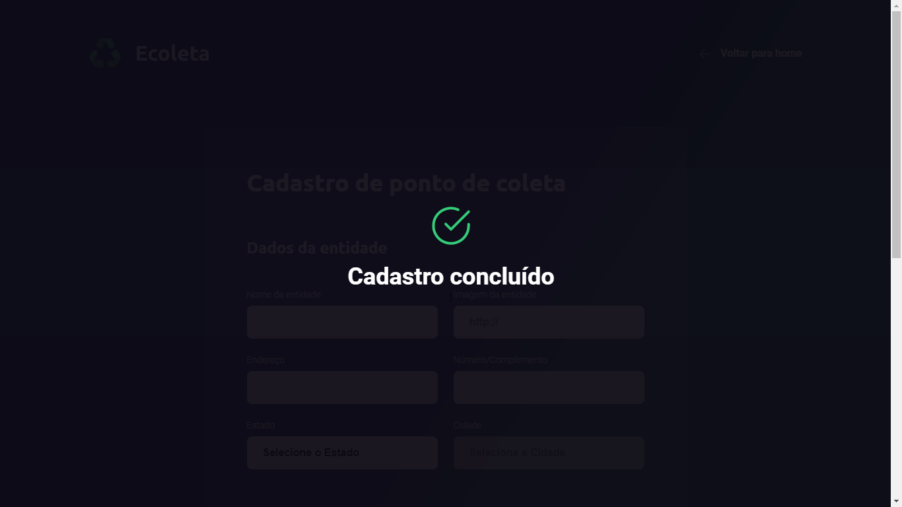
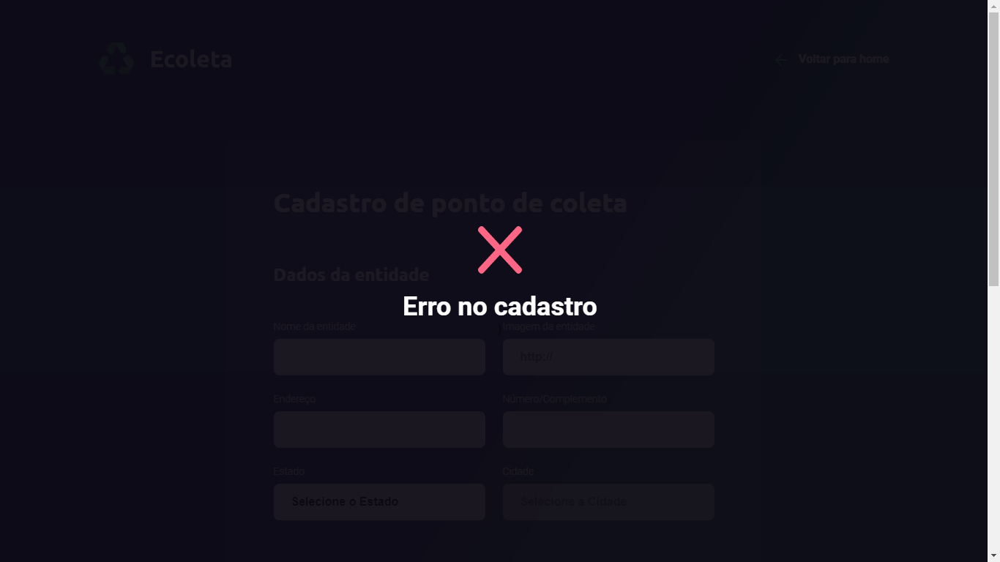
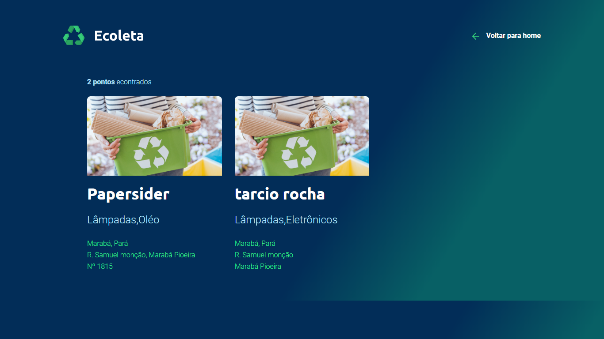

  <h1 align="center">
    Next Level Week by  
  </h1>
  
  

  

_________

### 🤔 Sobre o que se trata ? 
A NLW é uma experiência online criada pela Rocketseat de uma semana com muito conteúdo prático, desafios, hacks e um projeto que nos ajudam a avançar para o próximo nível e impulsionar a nossa carreira. 🤩🤩
  
### ✨ Sobre o projeto:

O Ecoleta é um projeto criado para gerenciar o processo de coleta de lixo nas cidades. Com ele, é possível ajudar pessoas a encontrarem pontos de coleta de uma forma mais eficiente.
  
### 👀 Meu aprendizado até aqui:
(Finalizado!!) - Projeto finalizado da NLW, onde desenvolvemos uma aplicação do zero até (Front-End e Back-End), nessa semana de aprendizado, eu conseguir colocar em práticas vários conceitos de programação com js, também conseguir aprimorar minhas habilidades com HTML e CSS, onde pude revisar conceitos básicos e colocá-los em prática novamente. Tive oportunidade de tirar dúvidas com outros devs que participaram do evento, compartilhar conhecimentos, ideias, etc..

<h2 align="center"> 📷 Screenshot da home page do projeto: </h2>

# [Uso]()

## Desenvolvimento

Para corrigir um bug ou melhorar um módulo existente, siga estas etapas:

- Garfo o repo
- Criar um novo ramo (`git checkout -b improve-feature`)
- Faça as alterações apropriadas nos arquivos
- Adicione alterações para refletir as alterações feitas
- Comprometa suas alterações (`git commit -am 'Improve feature'`)
- Empurre para o ramo (`git push origin improve-feature`)
- Crie uma solicitação de atração

# Construído com:
- [HTML](#) - HTML é uma linguagem de marcação utilizada na construção de páginas na Web.

- [CSS](#) - Cascading Style Sheets é um mecanismo para adicionar estilo a um documento web.

- [JAVASCRIPT](#) - JavaScript é uma linguagem de programação interpretada estruturada, de script em alto nível com tipagem dinâmica fraca e multiparadigma. 

- [Node.JS](https://nodejs.org/en/) - Node.js é um tempo de execução JavaScript construído no motor V8 JavaScript do Chrome.

- [Nunjucks](https://www.npmjs.com/package/nunjucks) - é um motor templating completo para javascript. É fortemente inspirado em jinja2. Veja os documentos

- [Express](https://expressjs.com/pt-br/) - O Express é um framework para aplicativo da web do Node.js mínimo e flexível que fornece um conjunto robusto de recursos para aplicativos web e móvel.

- [MySQL](https://www.mysql.com/) - O MySQL é um sistema de gerenciamento de banco de dados, que utiliza a linguagem SQL como interface.

- [MySQL](https://www.mysql.com/) - O MySQL é um sistema de gerenciamento de banco de dados, que utiliza a linguagem SQL como interface.

_________

  | 
  ---|---
[Perfil Github ](https://github.com/iharsh234) |[Perfil Linkedin](https://www.quandl.com)

_________
<h4 align="center">❤❤❤ O evento foi de grande aprendizado, onde poderei aplicar os conhecimentos adquidos em outros projetos ❤❤❤ </h4>